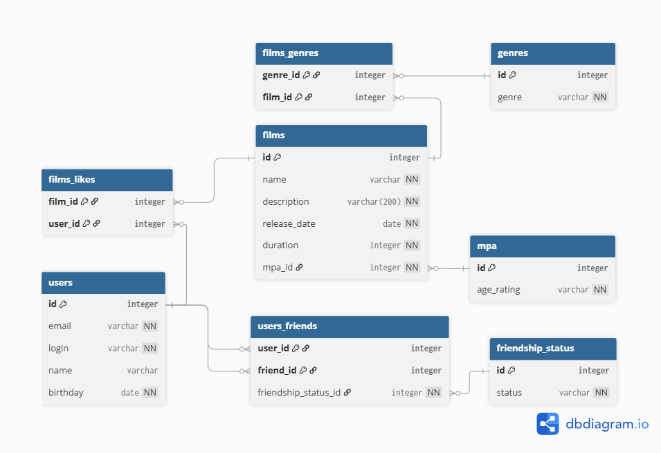

# java-filmorate


## Основные команды БД:


### 1. Получить основную информацию о фильме

```SQL
SELECT name, description, release_date, duration 
FROM films
WHERE id = {id вашего фильма}; 
```


### 2. Получить топ 10 фильмов по лайкам 

```SQL
SELECT f.name, COUNT(fl.user_id) AS likes 
FROM films AS f 
LEFT JOIN films_likes AS fl ON fl.film_id = f.id
GROUP BY f.id, f.name 
ORDER BY likes DESC 
LIMIT 10;
```

### 3. Получить возрастной рейтинг фильма 

```SQL
SELECT mpa.age_rating 
FROM films as f 
JOIN mpa ON f.mpa_id = mpa.id 
WHERE f.id = {id вашего фильма};
```

### 4. Получить жанры фильма 

```SQL
SELECT g.genre 
FROM films_genres AS fg 
JOIN genres AS g ON fg.genre_id = g.id 
WHERE fg.film_id = {id вашего фильма};
```

### 5. Получить основную информацию о пользователе 

```SQL
SELECT email, login, name, birthday 
FROM users 
WHERE id = {id нашего юзера};
```


### 6. Получить друзей пользователя 

```SQL
SELECT friend_id 
FROM users_friends AS uf 
JOIN friendship_status AS fs ON fs.id = uf.friendship_status_id 
WHERE user_id = {id нашего юзера} AND fs.status = 'CONFIRMED';
```

